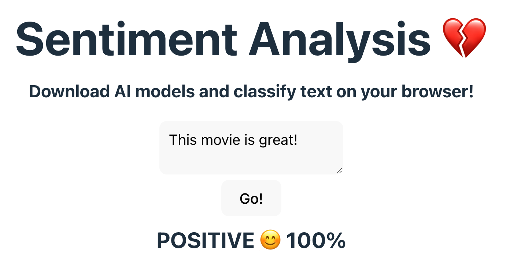

# Client Side Sentiment Analysis

This project showcases a minimal example on how to run sentiment analysis on your
browser. It uses [React](https://react.dev/)+[Vite](https://vitejs.dev/) and 
[Transformers.js](https://huggingface.co/docs/transformers.js/index). Inspired by the [examples on
Transformers.js](https://huggingface.co/docs/transformers.js/index#examples).

Here's how the app looks like:

  

## Quickstart

1. **Installation:** Ensure Node.js is installed. Use `npm install` to install dependencies.

2. **Development:** Run `npm run dev` to start the development server.

3. **Usage:** Input text in the provided area and click "Classify" to analyze the sentiment.
